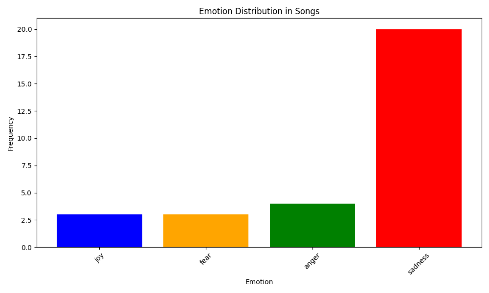

# Sanremo 2024

Una semplice analisi delle le canzoni in gara alla 74esima edizione del Festival di Sanremo.

## Wordcloud


## Emotion distribution



Per trovare le emozioni è stato utilizzato il modello [`MilaNLProc/feel-it-italian-emotion`](https://huggingface.co/MilaNLProc/feel-it-italian-emotion). Una descrizione completa [qui](https://aclanthology.org/2021.wassa-1.8/). Un ringraziamento particolare a [MilaNLProc](https://huggingface.co/MilaNLProc).

## How to?

I testi delle canzoni si trovano in `songs_text/`, uno per ogni canzone in gara. 
Per generare la wordcloud basta eseguire il seguente comando:

```bash
pip install -r requirements.txt
python analysis.py
```

**Enjoy!**
