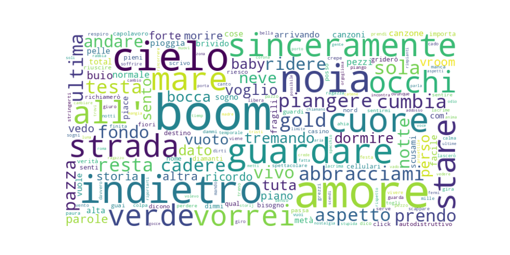

# Sanremo 2024

[🇬🇧 English version below](#sanremo-2024-analysis)

Una semplice analisi delle le canzoni in gara alla 74esima edizione del Festival di Sanremo.

## Wordcloud



## Emotion distribution


Per trovare le emozioni è stato utilizzato il modello [`MilaNLProc/feel-it-italian-emotion`](https://huggingface.co/MilaNLProc/feel-it-italian-emotion). Una descrizione completa [qui](https://aclanthology.org/2021.wassa-1.8/). Un ringraziamento particolare a [MilaNLProc](https://huggingface.co/MilaNLProc) per aver reso disponibile il modello.

## How to?

I testi delle canzoni si trovano in `songs_text/`, uno per ogni canzone in gara. 
Per generare la wordcloud basta eseguire il seguente comando:

```bash
pip install -r requirements.txt
python analysis.py
```

**Enjoy!**

---

# Sanremo 2024 analysis

A simple analysis of the songs competing in the 74th edition of the Sanremo Festival.

## Wordcloud


## Emotion distribution


To find the emotions, I used the freely distributed model [`MilaNLProc/feel-it-italian-emotion`](https://huggingface.co/MilaNLProc/feel-it-italian-emotion). A complete description [here](https://aclanthology.org/2021.wassa-1.8/). A special thanks to [MilaNLProc](https://huggingface.co/MilaNLProc) for making the model available.

## How to?

The lyrics of the songs are in `songs_text/`, one for each competing song.

To generate the wordcloud, just run the following command:

```bash
pip install -r requirements.txt
python analysis.py
```

**Enjoy!**
